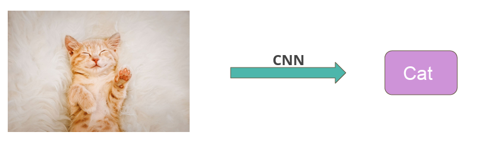

#  Image Classification
> In strong basleine :white_check_mark:

model here  :point_right: : [link](ML_practrice/Classification/ML2023-HW3-ImageClassification/ML2023-HW3-ImageClassification.ipynb)

## Task Description
Solve image classification with convolutional neural networks(CNN).

## Model Structure
* **Model**: Convolution Neural Network
* **Input**:  The images are collected from the food-11 dataset splitted into 11 classes. 
  * Training set: 10000 labeled images 
  * Validation set: 3643 labeled images  
  * Testing set: 3000 images without labeled

* **Evaluation Metrics**: Accuracy
## TO-DO
 * **Do some Data Augmentation & Train longer**
    * method 1:ramdom horizontal flip , random crop
    * method 2: epoch -> 80
 * **Use predefined CNN from torchvision or TensorFlow**
    *　method 1: resnet18
 * **Cross Validation + Ensemble or any other methods you know**
    * method 1: ensemble VGG + resnet (not yet finished)
## Performance