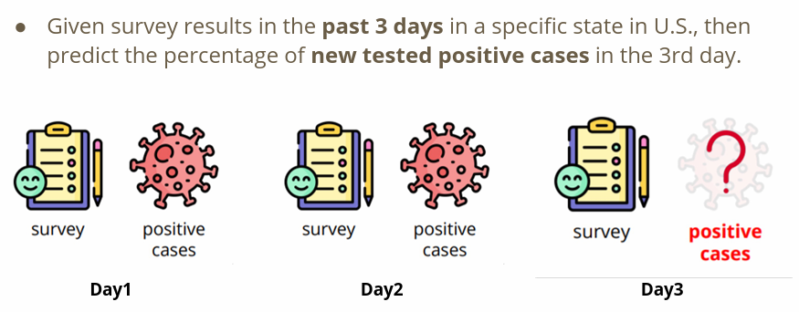
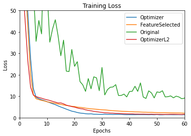
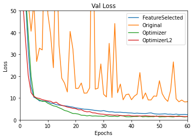

# COVID-19_Cases_Prediction
> In strong basleine :white_check_mark:
> 
model here :point_right: : [link](ML_practrice/Regression/ML2023-HW1-COVID-19_Cases_Prediction/ML2023-HW1-COVID-19_Cases_Prediction.ipynb)

## Task Description
This is a classic binary classification problem, so we use logistic regression as our classification model.

## Model Structure
* **Model**: Logistic Regression
* **Input**: States(35), COVID-like illness(5), Behavior indicators(5), Belief indicators (2), Mental indicator (2), Environmental indicators (3), Tested Positive Cases (1)
* **Evaluation Metrics**: Mean Squared Error (MSE)
## TO-DO
* **Select suitable feature columns**
  * method 1: leave the states features out `[:35]`
* **Define your optimization algorithm**
    * `method 1: Optimizer choosing &rarr; adam performs the best , with lr = 0.001 (other params are in default)`
    * method 2: L2 regularization &rarr; weight_decay = 0  
## Performance

