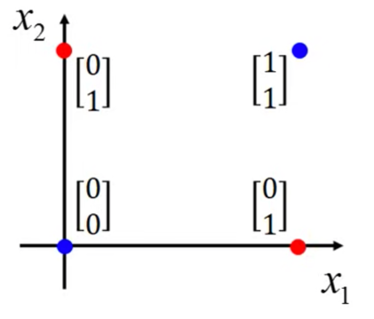

# Regression Model
> [!NOTE]  **Summary**
> There are total of **1** projects using regression model.
> Most used model : **Logistic Regression**

### Projects
| Name |Model|
 Last Update Date| Link |
|  :-: | :-:  |  :-:  | :-: |
| HW1-COVID-19_Cases_Prediction  | Logistic Regression | 2023/9/24  | [:door:](ML2023-HW1-COVID-19_Cases_Prediction/) |

## What is Regression?

Regression is a statistical method used to examine the relationship between one dependent variable and one or more independent variables. It aims to model the pattern of the data and make predictions.

## Logistic Regression
Logistic Regression is a statistical method used for **binary classification**, which means it is employed when the target variable has two possible outcomes. 

$$
 L(b_0,b_1,…,b_n)=∑^{i=1}_m
[y^{(i)}log(P(Y=1))+(1−y^{(i)})log(1−P(Y=1))]
$$

It is based on the logistic function (also called the sigmoid function), which is an S-shaped curve. The logistic function takes any real-valued number and maps it to a value between 0 and 1.

## Loss Function

$$
J(θ)=− \frac{1}{m}∑_{i=1}^m∑_{k=1}^C​y_i^k​log(\hat{y}_i^k)
$$
* $J(θ)$ is the cross-entropy loss.
* θ represents the parameters of the model.
* $m$ is the number of training examples.
* $C$ is the number of classes.
* $ y_i^k $ is the ***ground truth label*** for the $i$-th example and $k$-th class.
* $\hat{y}_i^k$ is the ***predicted probability*** that the $i$-th example belongs to class $k$.

## Advantages
* Computationally efficient and does not require a high amount of computational resources.
* Outputs probabilities, which can be **useful for understanding** the confidence of predictions.
## Limitations
* Assumes a linear relationship between features and the log-odds of the outcome. May not perform well if the relationship is highly non-linear.
* No way to divide the data with a linear line.
  

