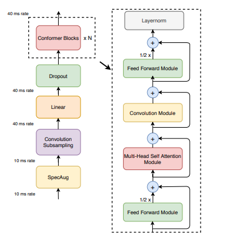

# SpeakerIdentification
> In strong basleine :white_check_mark:

model here  :point_right: : [link](ML_practrice/Classification/ML2023-HW4-SpeakerIdentification/ML2023_HW4-SpeakerIdentification.ipynb)

## Task Description
Predict the speaker from given speech.

## Model Structure
* **Model**: Transformer
* **Input**:  Data is collectsd from **VoxCeleb2** and processed.
  * Training: 56666 processed audio features with labels.
  * Testing: 4000 processed audio features (public & private) without labels.
  * Label: 600 classes in total, each class represents a speaker

* **Evaluation Metrics**: Cross Entropy Loss
## TO-DO
 * **Build a self-attention network to classify speakers with sample code**
 * **Modify the parameters of the transformer modules in the sample code.** &rarr; the most effective
    * method 1: add in encoder 
    * method 2: modify the predict layer add more linear
 * **Construct Conformer, which is a variety of Transformer.**
    * method 1: change the parameter 
    * method 2: implement conformer 
 * **Implement Self-Attention Pooling & Additive Margin Softmax to further boost the performance**
    * method 1: self-attention pooling to replace mean pooling